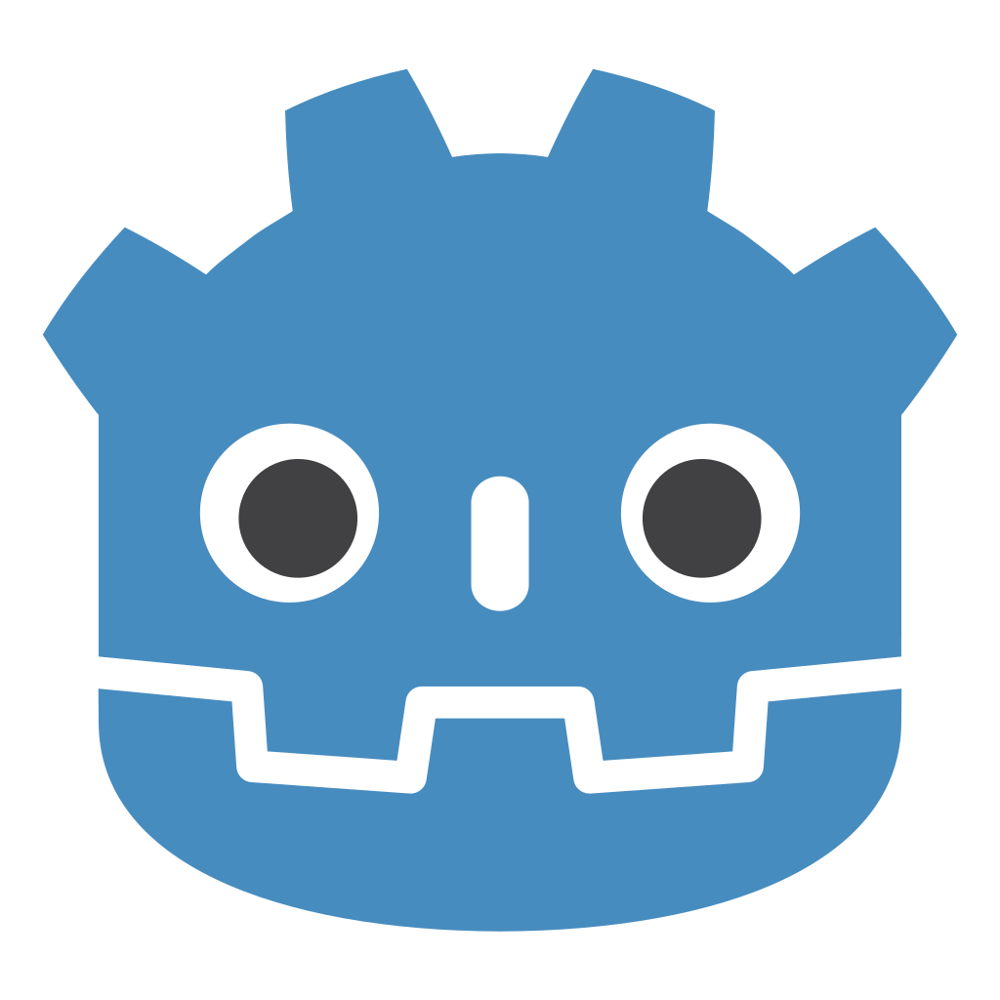
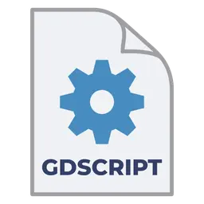

# Bienvenue sur la notice Administateur


<p align="center">
  
</p>


<h1 align ="center" >Gladius Dominus </h1>

<div style="page-break-before: always;"></div>

<div align ="center" >

# Table des Matières
1. [Introduction ](#introduction)
2. [Description du système](#description-du-système)
3. [Installation](#installation)
    1. [Version navigateur](#version-navigateur)
    2. [Version Steam](#version-steam)
4. [Configuration](#configuration)
5. [Exploitation](#exploitation)
5. [Annexes](#annexes)

</div>
<div style="page-break-before: always;"></div>

## Introduction
Ce projet est un jeu vidéo d'attaque défense qui fonctionne avec le moteur de jeu Godot Engine
.
 Voici comment accéder au code source de ce jeu et y apporter des modifications.

## Description du système
Le projet utilise l'architecture typique d'un projet fait avec Godot Engine. On y retrouve :
- Les assets, qui contiennent les différents sprites, tilesets, et autres.
- Les scripts, où se trouve le code source
- Les scènes, qui sont un type de fichier spécifique à Godot. Elles représentent les "briques" du projet et sont reliées à des scripts de code.  
Le langage utilisé est le GdScript
, spécifique à Godot et très similaire au Python.

<p align="center">
  
</p>

## Installation
Depuis le [Dépôt GitHub](https://github.com/Aurelienxx/Gladius), commencez par télécharger le projet.  
Pour ce faire, sélectionnez le bouton vert ```Code```, puis choisissez ```Download ZIP```. Décompressez le dossier téléchargé, et vous possédez maintenant le projet.  
  
Pour l'ouvrir, il vous faut le moteur de jeu gratuit Godot Engine. Deux options s'offrent à vous pour le télécharger.

<p align="center">
  
</p>

### Version navigateur
Rendez-vous sur [le site de Godot](https://godotengine.org/fr/) et sélectionnez "Télécharger la dernière version". Aucune autre action de configuration n'est nécessaire, vous devez simplement indiquer à Godot le chemin d'accès vers le projet que vous souhaitez utiliser.  
Un inconvénient de cette version est que si Godot est mis à jour, vous devrez manuellement télécharger la nouvelle version, recommençant cette étape.

<p align="center">
  
</p>

### Version Steam
Si vous possédez l'application de redistribution Steam, vous pouvez y télécharger Godot directement, recherchez simplement le nom du logiciel et choisissez `Ajouter à la bibliothèque`, puis rendez-vous dans celle-ci et faites `Télécharger`. Aucune autre action de configuration n'est nécessaire, vous devez simplement indiquer à Godot le chemin d'accès vers le projet que vous souhaitez utiliser.
Les mises à jour vers de nouvelles versions se feront automatiquement.

<p align="center">
  
</p>

## Configuration
En cas de modification nécessaire, seul le code source ou les assets seront utiles. Pour une bonne lisibilité, rendez-vous dans le dossier ```scènes``` et trouvez l'aspect du jeu à modifier en parcourant l'arborescence jusqu'à trouver un ```nom_fichier.tscn```. De là, sur le volet à gauche se trouvent les Nodes de la scènes, eux_même liés à des scripts de code. Sélectionnez l'icône de feuille de papier .
 pour ouvrir le script correspondant, et vous pouvez y modifier le code.

<p align="center">
  
</p>

## Exploitation
Une fois vos modifications apportées, si la console n'indique aucune erreur dans le code, vous pouvez lancer le jeu pour vérifier vos modifications. Rendez-vous sur la scène ```MainMenu``` (./scenes/MainMenu/MainMenu.tscn) et cliquez sur l'icône "Exécuter la scène actuelle" 
.
 pour ouvrir le jeu.
Vous avez aussi la possibilité de lancer directement le jeu depuis n'importe où, en cliquant sur "Lancer le projet"

## Annexes
[Documentation de Godot Engine](https://docs.godotengine.org/en/stable/)  
[Documentation langage GdScript](https://docs.godotengine.org/en/stable/tutorials/scripting/gdscript/gdscript_basics.html)  
[Notice utilisateur du jeu](https://aurelienxx.github.io/Gladius/userNotice.html)  


