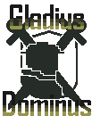
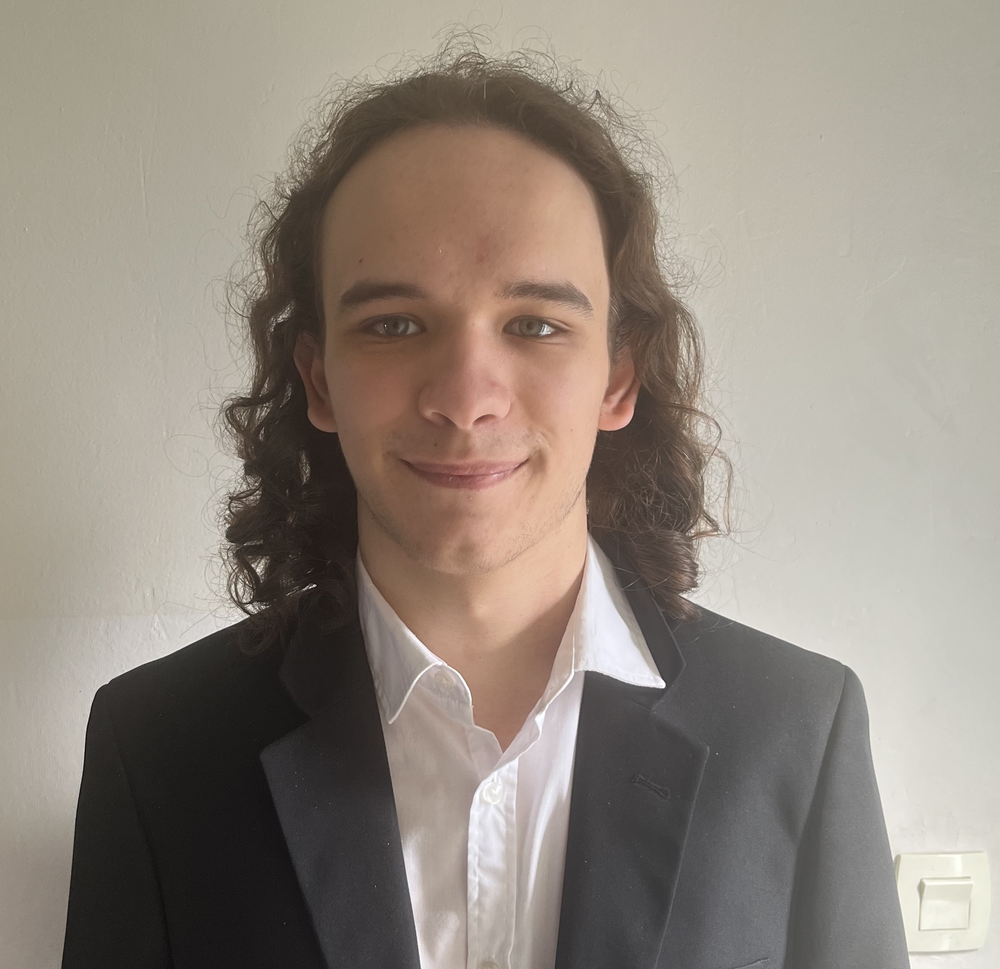
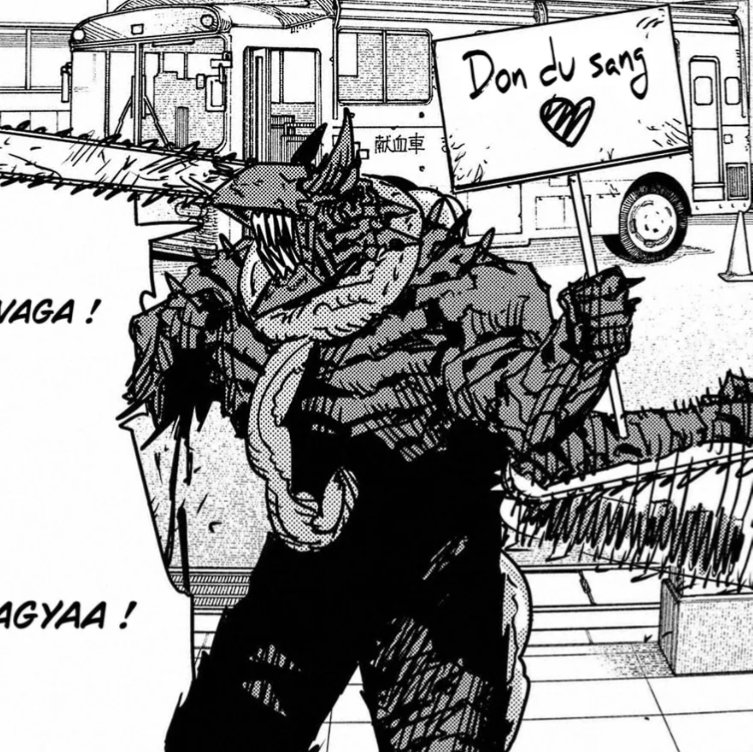
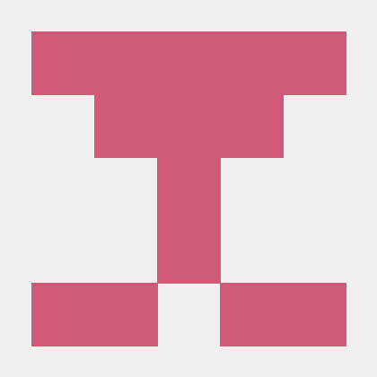
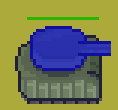

# Accueil

Bienvenue sur le site de Gladius Dominus

  

## Documentations 
- [Notice Utilisateur](userNotice.md)
- [Notice Administateur](adminNotice.md)

---

### L'équipe

  

    
    
<strong>Samuel Larangé</strong> 💻 Développeur

  

  

    
    
<strong>Noa Deletang-Devin</strong> 💻 Développeur

  

  

    
    
<strong>Clément Cotar</strong> 💻 Développeur

  

  

    
    
<strong>Edwyn Piquet</strong> 💻 Développeur 🧑‍💼 Chef de projet 📋 Chargé de comm

  

  

    
    
<strong>Aurélien Fontaine</strong> 💻 Développeur 🧑‍💼 Chef d'équipe

  

  

    
    
<strong>Léothen Dusannier</strong> 💻 Développeur 🎨 Artiste

  

