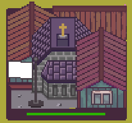
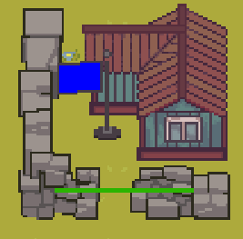
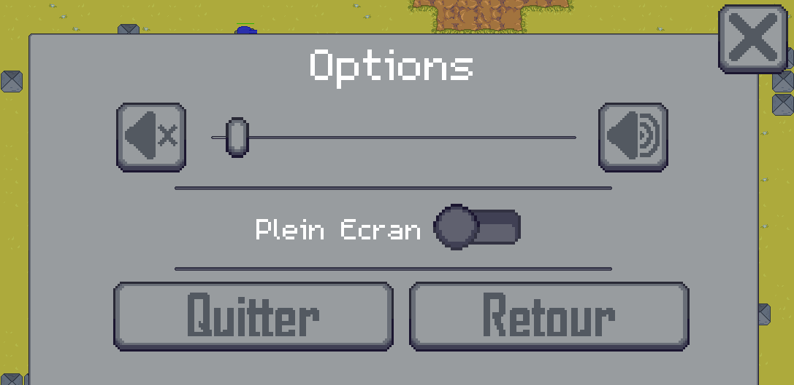

# **Notice utilisateur**

  

<h1 align ="center" >Gladius Dominus </h1>

# **Table des Matières**
1. [Présentation du jeu ](#presentation-du-jeu)
2. [Présentation de la zone de jeu](#presentation-de-la-zone-de-jeu)
    1. [Map](#map)
    2. [Herbe](#herbe)
    3. [Boue](#boue)
    4. [Obstacle](#obstacle)
3. [Présentation des unités](#presentation-des-unités)
    1. [Infantrie](#infantrie)
    2. [Camion](#camion)
    3. [Artillerie](#artillerie)
    4. [Tank](#tank)

## **Présentation du jeu** 

Gladius Dominus est un jeu au tour par tour, dans lequel vous devez à la fois défendre votre base, et détruire celle de votre adversaire.

Pour ce faire, vous pourrez placer des unités sur la carte en utilisant vos ressources. Celles-ci peuvent se déplacer et attaquer, et disposent toutes de statistiques différentes (portée, dégâts, points de vie, ...).
Vous pouvez aussi prendre possession des villages ou de la ville répartis sur la carte, qui confèrent un avantage non négligeable. Enfin, les structures comme le QG peuvent être améliorées, conférant un meilleur bonus ou gagnant la capacité de se défendre.
Une partie prend fin lorsque l'un des deux QG est détruit.

## **Comment lancer une partie** 

Une fois le jeu lancer il vous suffit de cliquer sur "Lancer jeu " comme sur l'image ci-dessous:

  

puis une fois ici de cliquer sur votre mode de jeu

  

et voila votre jeu est lancé 

## **Présentation de HUD**

Sur l'image si-dessous nous pouvons voir HUD du jeu 

  

**Réserve d'or** 

Vous montre l'or que vous avez actuellement et les gains ou perte que vous aurez vous au prochain tour

**La roue crenté** 

Vous permet d'accéder a l'ecran echap.

**End Turn** 

Vous permet de terminer votre tour.

**Spawn Unite**

Le bouton avec les trois trais vous permet d'ouvrir le menu spawn des unités. 

  

En cliquand sur les boutons de spawn des unité vous créer une unité en enlevant de l'or dans votre banque ainsi qu'en diminuant vos gains qui parte pour leur maintenance

## **Présentation de la zone de jeu**

### **MAP** 

Le terrain de jeu de Gladius Dominus repsésente un champ de bataille.

  

Sur cette carte se trouve différent terrain apportant des malus 

### **Herbe**

L'herbe est le type de terraine le plus commun il n'apporte pas de malus et permet aux unités de se déplacer librement.

  

###  **Boue** 

La boue ralentie les unité passant dessus les empêchant de se déplacer librement ce qui réduit leur capacité de déplacement de moitié.

  

### **Obstacle**

Les obstacles empêche le passage des unité les obligeants a les contourné.

  

## **Présentation des unités** 

### **Infanterie** 
L'infanterie bien qu'étant une unité plutôt faible, elle présente un coût idéal en debut de partie avec une bonne mobilité mais de faibles dégâts. 

  

**Statistique :**

- Coût : 15
- Coût de maintenance : 2
- Vie : 85
- Dégâts : 30
- Capacité de déplacement : 4 cases
- Portée d'attaque : 2 cases

### **Camion**
Le Camion bien qu'ayant un coût plus élevé que l'infanterie et les mêmes dégâts cette unité se distingue par sa grande mobilité.

  

**Statistique :**

- Coût : 60
- Coût de maintenance : 3
- Vie : 150
- Dégâts : 30
- Capacité de déplacement : 10 cases
- Portée d'attaque : 3 cases

### **Artillerie**
L'artillerie est une unité coutant assez cher il a une tres faible mobilité mais compense cela par sa puissance ainsi que sa porté. 

  

**Statistique :**

- Coût : 90
- Coût de maintenance : 3
- Vie : 300
- Dégâts : 75
- Capacité de déplacement : 2 cases
- Portée d'attaque : 7 cases
### **Tank**
Le tank est l'unité la plus chère elle se distingue par sa résistance cumulé a sa vitesse et ses dégats. 

  

**Statistique :**

- Coût : 150
- Coût de maintenance : 5
- Vie : 400
- Dégâts : 80
- Capacité de déplacement : 5 cases
- Portée d'attaque : 4 cases

## **Présentation des Bâtiments** 

### **Village**
Les villages sont des bâtiments capturables présent sur la map il permette de renforcer votre économie. 

  

**Statistique :**

- Vie : 200
- Gain : 10

### **Ville**
La Ville est un bâtiment capturable présent sur la map il permet de renforcer votre économie. 

  

**Statistique :**
- Vie : 200
- Gain : 15

### **QG**
Le QG est votre objectif à défendre. Il genere des revenu et peut être améliorer afin de vous aider dans votre combat. 

- Le niveau 1 : 

  

**Statistique :**

- Vie : 1 000
- Gain : 15

- Le niveau 2 : 

  

**Statistique :**

- Vie : 1 000
- Gain : 30
- Coût d'amélioration : 150

- Le niveau 3 : 

  

**Statistique :**

- Vie : 1 000
- Gain : 30
- Dégats : 15 
- Distance d'attaque : 5
- Coût d'amélioration : 275

### **Capture des villes et village**

Pour capturer une ville ou un village neutre il vous suffit d'amener une de vos unité à côté de vos batiments puis la capture se fait le drapeau prend la couleurs de votre équipe.

Dans le cas ou le batiment que vous voulez capturer et sous le contrôle ennemi il vous suffit de détruire le batiments puis ensuite d'aller le capturer.

## **Présentation des contrôles**

### **Contrôles des unités** 

**Clic gauche**: Permet de selectionner une unité ou de valider une action pour le déplacement ou l'attaque.

  

**Clic Droite**:Sur une unité permet de le selectionner en mode attaque un **Clique droit** permet le choix d'attaque de l'unité.

  

### **Contrôles des batiments**

**Clic gauche**: Permet de selectionner un batiment afin d'ouvrir sa page d'amélioration.

  

### **Autre Contrôle**

**ECHAP**: Permet d'afficher la page afin de regler les paramètre 

  

