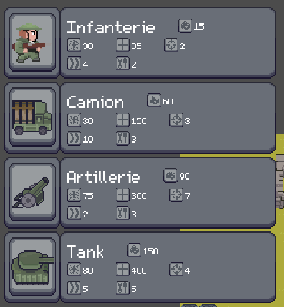
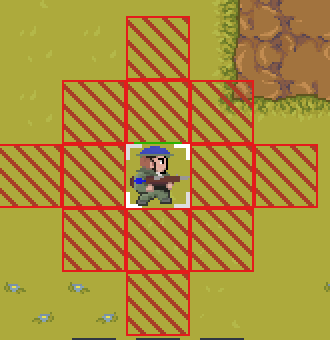

# **Notice utilisateur**

  

<h1 align ="center" >Gladius Dominus</h1>

# Table des Matières
1. [Présentation du jeu](#présentation-du-jeu)
2. [Interface de jeu](#présentation-du-hud)
3. [Zone de jeu](#présentation-de-la-zone-de-jeu)
4. [Unités](#présentation-des-unités)
   1. [Infanterie](#infanterie)
   2. [Camion](#camion)
   3. [Artillerie](#artillerie)
   4. [Tank](#tank)
5. [Bâtiments](#présentation-des-bâtiments)
   1. [Villages](#village)
   2. [Villes](#ville)
   3. [QG](#qg)
6. [Contrôles](#présentation-des-contrôles)

## **Présentation du jeu** 

Gladius Dominus est un jeu au tour par tour, dans lequel vous devez à la fois défendre votre base, et tenter de détruire celle de votre adversaire.

Pour ce faire, vous pourrez placer des unités sur la carte en utilisant vos ressources. Celles-ci peuvent se déplacer et attaquer, et disposent toutes de statistiques différentes (portée, dégâts, points de vie, ...).  
Vous pouvez aussi prendre le contrôle des villages ou de la ville répartis sur la carte, qui confèrent un avantage non négligeable. Enfin, les structures comme le QG peuvent être améliorées, conférant un meilleur bonus ou gagnant la capacité de se défendre.

Une partie prend fin lorsque l'un des deux QG est détruit.

## **Comment lancer une partie** 

Une fois le jeu lancé, il vous suffit de cliquer sur "Lancer jeu " dans le menu principal puis de sélectionner votre mode de jeu.

  
  

### **Paramétrages**

Les paramètres sont accessibles depuis le menu principal, ou en pleine partie en appuyant soit sur **ECHAP**, soit sur l'icône
.  
Vous pouvez y régler le volume, passer en plein écran, ou quitter le jeu proprement.

  

## **Présentation du HUD**

**HUD**

  

    
  

| Caractéristique  | Description                                                                            |
| ---              | ---                                                                                    |
| `Réserve d'or`   | Indique combien d'or vous possédez + le gain/perte qui sera subi au prochain tour      |
| `La roue dentée` | Permet d'accéder aux paramètres                                                        |
| `EndTurn`        | Met fin à votre tour et permet au joueur adverse de commencer le sien                  |
| `Menu hamburger` | Déroule la liste des unités                                                            |
  

  
**Apparition d'unités**

  

    
  

| Icône | Signification                 |
| ---                                   | ---                                                                                 |
|          | Un coût, qui vous sera débité de   votre réserve d'or au placement de l'unité       |
|        | Une capacité de dégâts, à infliger aux adversaires                                  |
|            | Un nombre de points de vie, qui baisse face aux dégâts reçus jusqu'à la destruction |
|       | Une portée d'attaque en nombre de cases                                             |
|   | Une portée de déplacement en nombre de cases                                        |
|   | Un coût de maintenance, qui augmente votre déficit de tour pour chaque unité en vie (Si vous aviez +15/tour, vous aurez +13/tour en plaçant une de ces unités) |

## **Présentation de la zone de jeu**

### **Carte** 

Le terrain de jeu de Gladius Dominus repsésente un champ de bataille.  
Sur cette carte se trouvent différents terrains ayant leurs propriétés

  

    
| Terrain                                                          | Description   |
| ---                                                              | ---       |
| | **L'herbe ou les ponts** : le type de terrain le plus commun, il permet aux unités de se déplacer librement selon peur portée de déplacement    |
| | **La boue** :  Ralentit les unités passant dessus, chaque case comptant pour 2 cases conssomées dans leur portée de déplacement       |
|    | **Les obstacles**  : Empêchent totalement le passage des unités, qui devront le countourner jusqu'à trouver un terrain acceptable pour passer      |  

## **Présentation des unités** 

Lors du tour, chaque unité peut se déplacer et attaquer, ou simplement attaquer.  
Vous pouvez retrouver la barre de santé de l'unité au dessus d'elle

### **Infanterie** 
L'unité d'infanterie est assez faible, autant en attaque qu'en points de vie.  
Mais son coût très faible et sa mobilité moyenne la rendent utile pour couvrir du terrain en grand nombre.

| Statistique                | Valeur                            |
| ---                        | ---                               |
| `Apparence`                | |
| `Coût`                     | 15                                |
| `Coût de maintenance`      | 2                                 |
| `Vie`                      | 85                                |
| `Dégâts`                   | 30                                |
| `Capacité de déplacement`  | 4 cases                           |
| `Portée d'attaque`         | 2 cases                           |

### **Camion**
Le Camion a un coût moyen, et se distingue par sa très forte mobilité.  
Il peut parcourir de très grandes distances en seulement quelques tours, et possède une attaque similaire à l'infanterie.

| Statistique                | Valeur    |
| ---                        | ---       |
| `Apparence`                |
| `Coût`                     | 60        |
| `Coût de maintenance`      | 3         |
| `Vie`                      | 150       |
| `Dégâts`                   | 30        |
| `Capacité de déplacement`  | 10 cases  |
| `Portée d'attaque`         | 3 cases   |

### **Artillerie**
L'artillerie est une unité assez chère ayant une très faible mobilité, quasiment statique.  
Cela est compensé par une énorme portée d'attaque, pouvant s'en prendre aux adversaires avant qu'ils n'approchent.

| Statistique                | Valeur    |
| ---                        | ---       |
| `Apparence`                |
| `Coût`                     | 90        |
| `Coût de maintenance`      | 3         |
| `Vie`                      | 300       |
| `Dégâts`                   | 75        |
| `Capacité de déplacement`  | 2 cases   |
| `Portée d'attaque`         | 7 cases   |

### Tank
Le tank est l'unité la plus chère et la plus puissante.  
Il est très résistant, possède une bonne portée, et inflige de très gros dégâts.  
Son seul inconvénient est son coût de maintenance, assez élevé pour devenir contraignant. 

| Statistique                | Valeur    |
| ---                        | ---       |
| `Apparence`                |
| `Coût`                     | 150       |
| `Coût de maintenance`      | 5         |
| `Vie`                      | 400       |
| `Dégâts`                   | 80        |
| `Capacité de déplacement`  | 5 cases   |
| `Portée d'attaque`         | 4 cases   |

## **Présentation des Bâtiments** 

Les bâtiments possèdent 2 états : Neutre ou capturé.  
Au début de la partie, tous les bâtiments sont neutres à l'exception des QG des deux équipes.
Pour capturer un bâtiment neutre, un joueur doit l'approcher avec une des ses unités.  
Si le bâtiment est déjà capturé par l'adversaire, il devra être détruit pour changer de camp.

Posséder un bâtiment confère un bonus de gain d'or au début de chaque tour, variant selon le bâtiment en question.

### **Village**
Les villages sont les bâtiments classiques, ils confèrent un bonus moyen.  
Il y en a 4 sur la carte : 2 à proximité de chaque QG, que les joueurs ont intérêt à capturer en début de partie pour s'assurer des gains.

| Statistique                | Valeur                                         |
| ---                        | ---                                            | 
| `Apparence`                ||
| `Vie`                      | 200                                            |
| `Gain`                     | +15 par tour                                   |

### **Ville**
La Ville est un bâtiment plus puissant, offrant un bonus conséquent.  
Il se trouve au centre de la carte et sera donc un emplacement de tensions lors de la partie.

| Statistique                | Valeur                                       |
| ---                        | ---                                          |
| `Apparence`                ||
| `Vie`                      | 200                                          |
| `Gain`                     | +20 par tour                                 |

### **QG**
Le QG est l'objectif principal du jeu.  
Vous devez établir une stratégie pour protéger le vôtre tout en attaquant celui de votre adversaire.  
Ce bâtiment peut être amélioré, moyennant un coût, pour augmenter davantage le gain par tour, ou même gagner la capacité d'infliger des dégâts aux unités qui approchent.

| Statistique                | Niveau 1                           | Niveau 2                           | Niveau 3                           |
| ---                        | ---                                | ---                                | ---                                |
| `Apparence`                ||||
| `Vie`                      | 1000                               | 1000                                | 1000                              |
| `Gain`                     | +15 par tour                       | +30 par tour                        | +50 par tour                      |
| `Coût d'amélioration`      | /                                  | 150                                 | 275                               |
| `Dégâts`                   | /                                  | /                                   | 15 par tour sur la case visée     |
| `Distance d'attaque`       | /                                  | /                                   | 5 cases                           |

## **Présentation des contrôles**

### **Clic sur unité**

| Contrôle              | Explication                             | Affichage |                 
| ---                   | ---                                     | ---       |                  
| `Clic gauche`   | Sélectionne une unité pour afficher les cases où elle peut se déplacer.  Un clic gauche sur une des cases lui permet de s'y rendre. |  |
| `Clic droit`      | Sélectionne une unité pour afficher les cases où elle peut attaquer.   Un clic gauche sur une unité ennemie se trouvant des cette zone permet de lui infliger des dégâts. |  |

### **Clic gauche sur QG**  
Permet d'ouvrir la page d'amélioration de votre QG.  
Un clic gauche sur une la prochaine amélioration achetable l'achète si vous avez les moyens.  
Un clic gauche en dehors de cette fenêtre la ferme.

  

### **Espace**  
Sélectionne une de vos unités non utilisées et centre la caméra dessus.  
Les unités non déplacées seront passées en revues, puis celles qui n'ont pas attaqué si elles se sont toutes déplacées.

### **Entrée**  
Raccourci pour mettre fin au tour

